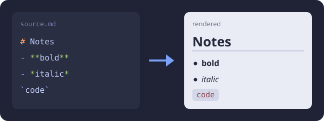

# Markdown Guide

Every section shows the **source** in a code block, then the same thing
**rendered**. Reopen this page with `:MdGuide`, close it with `q`.

---

## Headings

```markdown
# Level 1 (the title of this page)
## Level 2 (the sections of this page)
### Level 3
#### Level 4
##### Level 5
###### Level 6
```

### Level 3

#### Level 4

##### Level 5

###### Level 6

Leave a blank line before and after a heading, and put a space after the
`#` marks.

---

## Paragraphs and line breaks

```markdown
A blank line starts a new paragraph.

A line ending in a backslash\
breaks here without a new paragraph.
Two trailing spaces do the same.
```

A blank line starts a new paragraph.

A line ending in a backslash\
breaks here without a new paragraph.

---

## Emphasis

```markdown
**bold**  *italic*  ***bold italic***  ~~strikethrough~~  `code`
```

**bold** · *italic* · ***bold italic*** · ~~strikethrough~~ · `code`

In airnvim select the text in visual mode and press `Ctrl-b` (bold),
`Ctrl-i` (italic) or ``Ctrl-` `` (inline code).

---

## Lists

### Bulleted and nested

```markdown
- First level
  - Second level (indent by two spaces)
    - Third level
- Back to the first level
```

- First level
  - Second level (indent by two spaces)
    - Third level
- Back to the first level

### Numbered

```markdown
1. First step
2. Second step
3. Third step
```

1. First step
2. Second step
3. Third step

### Mixed

```markdown
1. Prepare
   - check the tools
   - read the notes
2. Build
```

1. Prepare
  - check the tools
  - read the notes
2. Build

Items under a number are indented to the text of that number: three spaces
after `1.`, four after `10.`.

### Tasks

```markdown
- [ ] To do
- [x] Done
- [-] In progress
- [~] Important
```

- [ ] To do
- [x] Done
- [-] In progress
- [~] Important

---

## Quotes and callouts

### Plain quote

```markdown
> A quote has no header.
>
> > Quotes can nest.
```

> A quote has no header.
>
> > Quotes can nest.

### Callout with its default title

```markdown
> [!NOTE]
> The type in brackets picks icon, colour and title.
```

> [!NOTE] The type in brackets picks icon, colour and title.

### Callout with a custom title

```markdown
> [!TIP] Remember this
> Text after the type replaces the default title.
```

> [!TIP] Remember this Text after the type replaces the default title.

### Callout types

```markdown
> [!IMPORTANT]
> [!WARNING]
> [!CAUTION]
> [!INFO]
> [!TODO]
> [!SUCCESS]
> [!QUESTION]
> [!FAILURE]
> [!BUG]
> [!EXAMPLE]
> [!QUOTE]
```

> [!IMPORTANT] Key information.

> [!WARNING] Needs attention.

> [!CAUTION] Risky: think twice.

> [!INFO] Background information.

<!-- -->

> [!TODO] Something left to do.

<!-- -->

> [!SUCCESS] It worked.

<!-- -->

> [!QUESTION] An open question.

<!-- -->

> [!FAILURE] It did not work.

<!-- -->

> [!BUG] A known problem.

<!-- -->

> [!EXAMPLE] A worked example.

<!-- -->

> [!QUOTE] Someone else's words.

Obsidian folds a callout when the type ends in `-` (closed) or `+` (open):
`> [!NOTE]-`. The browser preview shows every callout as a plain quote.

---

## Links

### Web and email

```markdown
[Neovim](https://neovim.io)
<https://neovim.io>
<name@example.com>
```

[Neovim](https://neovim.io) · <https://neovim.io>

### Other notes

```markdown
[Same directory](nvim-cheatsheet.md)
[Subdirectory](projects/plan.md)
[Parent directory](../archive/old.md)
[Absolute path](/home/user/notes/todo.md)
[Heading in this note](#lists)
[Heading in another note](nvim-cheatsheet.md#search)
```

[Same directory](nvim-cheatsheet.md) · [Heading in this note](#lists)

Paths are relative to the file that contains the link. A heading anchor is
its text in lowercase, with spaces turned into dashes.

In airnvim, `Enter` or `Ctrl`+click follows a link, and `␣il` writes one
for you: pick the note from a list and the path is filled in.

### Wikilinks (Obsidian)

```markdown
[[nvim-cheatsheet]]
[[nvim-cheatsheet|shown text]]
[[folder/note]]
[[note#Heading]]
```

[[nvim-cheatsheet]] · [[nvim-cheatsheet|shown text]]

Obsidian finds a wikilink by name anywhere in the vault; pandoc and the
browser preview do not understand them.

### Reference style

```markdown
Read [the manual][docs] first.

[docs]: https://neovim.io/doc
```

Read [the manual][docs] first.

[docs]: https://neovim.io/doc

---

## Images

```markdown

```


The text in square brackets is the alt text. When an image stands alone in
its paragraph, pandoc turns that text into the figure caption.

```markdown


{ width=15cm }
![[photo.png]]
![[photo.png|400]]
```

`{ width=15cm }` is a pandoc attribute: it sets the size of the image in
the PDF (typst) and changes nothing in the editor. The last two are
Obsidian embeds; `|400` sets the width in pixels.

In airnvim, copy an image and press `␣ip` or run `:PasteImage`: it asks for
a name, saves `assets/YYYY-MM-DD_HH-MM-SS_name.png` next to the file and
writes the link for you, with `{ width=15cm }` already added.

---

## Code

### Inline

```markdown
Run `nix build` in the repository.
```

Run `nix build` in the repository.

### Block

````markdown
```bash
echo "the word after the backticks picks the highlighting"
```
````

```bash
echo "the word after the backticks picks the highlighting"
```

Use `text` when there is no language. To show a code block inside a code
block, fence the outer one with four backticks.

---

## Tables

```markdown
| Left     | Centre | Right |
| :------- | :----: | ----: |
| apples   |   3    |  1.20 |
| pears    |   12   |  0.80 |
```

| Left     | Centre | Right |
| :------- | :----: | ----: |
| apples   |   3    |  1.20 |
| pears    |   12   |  0.80 |

The colons in the second row set the alignment. Write `\|` for a pipe
inside a cell.

---

## Footnotes

```markdown
A claim that needs a source.[^1]

[^1]: The source, shown at the end of the document.
```

A claim that needs a source.[^1]

[^1]: The source, shown at the end of the document.

---

## Horizontal rule

```markdown
---
```

Three dashes alone on a line, with blank lines around them.

---

## Escaping

```markdown
\*not italic\*  \# not a heading  \[not a link\]
```

\*not italic\* · \# not a heading · \[not a link\]

---

## Front matter

```markdown
---
title: Meeting notes
date: 2026-09-27
tags: [work, planning]
---
```

Only at the very top of a file. Obsidian shows it as properties, pandoc
reads the title and date from it.

---

## Writing in airnvim

- `:PreviewMd` opens a live preview in the browser, `:PreviewMd stop`
  closes it
- `:MdWrap` rewraps the paragraphs; saving does it too
- `:SpellToggle` or `␣z` checks spelling in this buffer
- `:NvCheat` opens the Neovim cheatsheet
